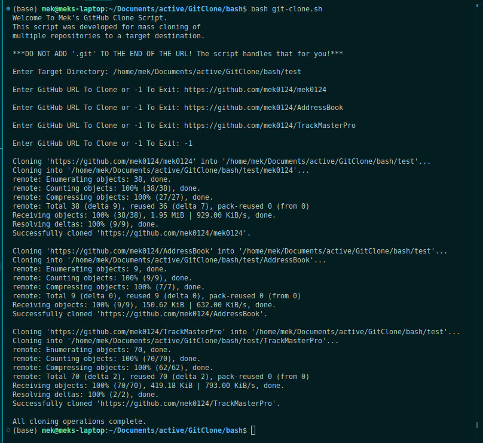

<label id="top"></label>

## GitClone - Bash

Table of Contents

- [Introduction](#introduction)
- [How To Use](#how-to-use---bash-script-️)
- [Issues](#issues)

### How To Use - Bash Script [⬆️](#top)

> Note: You will need Bash installed => [windows](https://www.howtogeek.com/790062/how-to-install-bash-on-windows-11/), [mac osx](https://scriptingosx.com/2019/02/install-bash-5-on-macos/), [linux](https://ioflood.com/blog/install-bash-shell-linux/)

> Note: The bash script is not setup to work with text files containing URLs. You will have to make this change yourself if you so wish for the ability. Otherwise, please use the cli app or the desktop app for working with text files.

- Clone the repo `git clone https://github.com/mek0124/GitClone.git`
- cd into the repo, then into bash
  - `cd GitClone`
  - `cd bash`
- run the bash script
  - `bash ./git-clone.sh`

Example Usage:

---

### Issues [⬆️](#top)

If at anytime you come into issues with this program, please create a new [issue](https://github.com/mek0124/GitClone/issues).